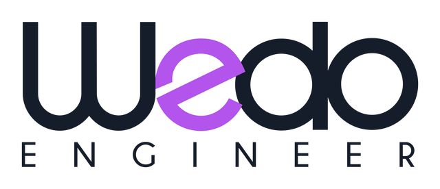

<p align="right"><a href="https://wedoengineer.com/es">
<picture>
  <source media="(prefers-color-scheme: dark)" srcset="docs/assets/wedoengineer-dark.png">
  
</picture>
</a></p>

# Honorario Justo

<p>
  <a href="https://github.com/cargeo95/honorario-justo/actions/workflows/ci.yml"></a>
  
  
  
  
  
  
</p>

**Observatorio de Mínima Cuantía.** ¿Cuánto paga el Estado colombiano por el trabajo profesional que exige?

En Colombia la norma pone **techo** a los honorarios de los contratistas: no pueden superar lo que gana el jefe de la entidad (Decreto 1068 de 2015, art. 2.8.4.4.6). Pero **no hay piso**. Cada gobernación y cada alcaldía fija su propia tabla, casi nunca publica el criterio técnico, y el mismo perfil vale muy distinto de un municipio a otro.

Honorario Justo analiza **todos** los procesos de mínima cuantía que se publican cada día en SECOP II, sin filtrar por palabras clave. De cada uno lee los documentos (estudios previos, análisis del sector, invitaciones) y extrae qué cargos se piden, cuánta experiencia se exige y cuánto se paga al mes. Cada cifra queda ligada al PDF y a la página de donde salió, y solo se publica después de una revisión humana.

## Principios

- **Trazabilidad.** Toda cifra lleva documento, página e imagen de la página. Si no se puede señalar, no se publica.
- **Revisión humana.** Todo hallazgo entra como `sin_revisar`. Solo los `confirmado` se usan en publicaciones.
- **Un día a la vez.** Cada corte corresponde a un día de publicación en SECOP: "analizamos todas las mínimas cuantías publicadas el 18 de septiembre y encontramos…".
- **Sin acusar.** Se muestra el contraste entre el perfil exigido y el pago, y se pregunta por el criterio. No se afirman irregularidades: el expediente por sí solo no las prueba.
- **Local y sin IA de pago.** Consulta, descarga, OCR y extracción corren en tu equipo. Ollama local es opcional y solo sirve como último recurso.

## Estructura

Arquitectura por capas: el dominio no depende de nada externo y cada capa solo usa las de abajo. El detalle, con diagramas, está en [docs/arquitectura.md](docs/arquitectura.md).

```
src/honorario_justo/
├── cli.py               # comando honorario-justo
├── config.py            # rutas y logging (sobrescribibles por variables de entorno)
├── dominio/             # reglas del negocio, sin I/O externo
│   ├── texto.py         #   normalización y vocabulario de cargos
│   ├── extraccion.py    #   cargo, experiencia exigida, pago mensual, SMLV
│   ├── aprendizaje.py   #   señales de página y reporte de lo aprendido
│   └── formato.py       #   cifras y fechas en español
├── fuentes/             # sistemas externos
│   ├── secop.py         #   API de Datos Abiertos (SECOP II)
│   ├── documentos.py    #   PDF: texto, OCR y puntuación de páginas
│   └── ocr.cjs          #   OCR con Tesseract.js (respaldo)
├── almacenamiento/
│   └── base_datos.py    # SQLite: casos, hallazgos, días, etiquetas
├── servicios/           # casos de uso
│   ├── analisis.py      #   analizar un proceso
│   ├── busqueda.py      #   búsqueda por palabras clave y próximo caso
│   ├── corte_diario.py  #   todos los procesos de un día
│   ├── hallazgos.py     #   extraer y revisar cifras
│   └── aprendizaje.py   #   reportes por día y acumulado
└── reportes/            # salidas
    ├── indicadores.py   #   resumen del día y de la semana
    ├── tablero.py       #   tablero HTML con mapa
    ├── imagenes.py      #   imágenes para LinkedIn y TikTok
    └── investigacion.py #   expediente de cada caso
tests/                   # pytest
scripts/                 # utilidades: verificación en vivo, OCR, reprocesos
docs/                    # arquitectura y recursos
```

Los datos (`data/`), los resultados (`Resultados/`, `Indicadores/`), los registros (`logs/`) y la guía editorial interna no se versionan.

## Instalación

Requiere Python 3.10 o superior.

```powershell
git clone https://github.com/cargeo95/honorario-justo.git
cd honorario-justo
python -m pip install -e ".[dev]"   # instala el paquete y el comando honorario-justo
python scripts/setup_ocr.py         # modelo de OCR en español (una sola vez)
```

## Uso

Para investigar caso a caso (búsqueda por palabras clave):

```powershell
honorario-justo --buscar
```

Este comando consulta SECOP II (modalidad Minima cuantia), descarga y analiza los PDF nuevos, y devuelve en JSON el proceso mas reciente con las tres evidencias (objeto, experiencia, presupuesto) que aun no se haya entregado, con extractos de texto y la ruta de su carpeta local en `data/cases/`. `--siguiente` hace lo mismo sin volver a consultar SECOP (usa lo ya analizado); `--once` solo ejecuta el ciclo de consulta sin elegir candidato.

A partir de ese candidato se redacta el contenido (LinkedIn, X, informe) y se exporta una carpeta numerada y autocontenida con:

```powershell
python -m honorario_justo.reportes.investigacion CO1.REQ.11017639 --title "Anapoima - costos de consultoria" --content contenido.json
```

`contenido.json` trae los textos ya redactados (`linkedin`, `x_post`, `x_thread`, `report`). Si se omite, se generan textos prudentes de plantilla. Se validan 3.000 caracteres para LinkedIn y 280 por bloque de X (texto simple en espanol; URLs computadas como 23 caracteres).

Una vez creada la carpeta, se marca el caso como entregado para no repetirlo:

```powershell
honorario-justo --entregado CO1.REQ.11017639
```

Si al revisar la carpeta el caso no sirve, ya quedo marcado como entregado (no se vuelve a sugerir) y basta con pedir `--siguiente` para el proximo.

## Revision

Cada caso entregado produce una carpeta en `Resultados/`, con un consecutivo global: `1. nombre`, `2. nombre`, etc. No sobrescribe expedientes anteriores. Conserva documentos descargados, texto extraido, tres capturas y paginas completas, fuentes, metadatos y los textos redactados para LinkedIn y X. Abrela con el explorador de archivos: no hay interfaz web ni servidor.

- `Evidencias/` trae las tres imagenes recortadas (objeto, experiencia, presupuesto) y sus paginas completas sin recortar en `Evidencias/Paginas_completas/`.
- `Documentos/` conserva todos los PDF descargados para el caso; `Texto_extraido/` y `Datos/` guardan la trazabilidad completa.
- `01_LinkedIn.txt`, `02_X.txt`, `03_X_hilo.txt` e `Investigacion.md` son los textos listos para copiar. Nada se publica automaticamente.
- `Fuentes.md` cita cada evidencia con su documento y numero de pagina.

Las carpetas `data/` y `Resultados/` se conservan entre sesiones. El indice SQLite de `Resultados/` evita repetir consecutivos y registra expedientes incompletos si falla una exportacion. `data/entregados.json` lleva la lista de procesos ya entregados en conversacion, para que `--buscar`/`--siguiente` no los repita.

## Corte diario e indicadores

Además del caso a caso, el observatorio puede tomar **todos** los procesos de mínima cuantía de un día (sin filtro de palabras clave), extraer cargo, años exigidos y pago mensual, y resumirlo en cifras del día:

```powershell
honorario-justo --dia                 # último día disponible en Datos Abiertos
honorario-justo --dia 2026-09-18      # un día específico
honorario-justo --dia 2026-09-18 --limite 5 --sin-ollama   # prueba rápida
```

Datos Abiertos se actualiza con uno o dos días de atraso: en la mañana del 22 lo último publicado suele ser del 20. Por eso `--dia` sin fecha toma el último día disponible y además **se pone al día**. Procesa los días que siguen al último corte completo y retoma los que quedaron a medias, hasta 7 días hacia atrás. La rutina es correrlo una vez al día. Un día completo (120-260 procesos) tarda del orden de minutos a una hora según el OCR. Si se interrumpe se retoma donde iba, porque lo analizado en las últimas 24 h no se repite.

Resultado:

- Tabla `dias` en `data/observatorio.sqlite`, con publicados, analizados, con página de pago y con cargo+pago extraído.
- Tabla `hallazgos`, con una fila por cargo+pago que incluye años exigidos, pago en pesos y en SMLV, método, confianza, archivo y página de origen, y estado de revisión.
- `Indicadores/dia_AAAA-MM-DD.md`: base del post del día, solo con cifras trazables. `--resumen AAAA-MM-DD` lo regenera sin consultar SECOP.

Otros comandos:

```powershell
honorario-justo --extraer [--reprocesar] [--sin-ollama]   # re-extrae desde lo ya descargado
honorario-justo --marcar 27 confirmado                     # revisión humana: confirmado | descartado | sin_revisar
honorario-justo --tablero                                  # Indicadores/tablero.html
honorario-justo --exportar                                 # CSV de hallazgos en Indicadores/
```

### Aprendizaje

Cada `--marcar ID confirmado|descartado` guarda una etiqueta en la tabla `etiquetas`, con el documento, la página, los títulos y las señales de la página de donde salió la cifra (por ejemplo "costos directos de personal", "factor multiplicador", "pólizas" o "conclusiones"). `honorario-justo --aprendizaje` escribe en `Indicadores/aprendizaje/`:

- `dia_AAAA-MM-DD.md`: uno por día de corte, solo con los procesos publicados ese día. Muestra lo que costó y rindió ese día, sin sugerir reglas. `--dia` lo escribe solo al cerrar cada día.
- `acumulado.md`: todos los días juntos. Es el único que sugiere reglas, porque un día solo no alcanza los umbrales.

Cada reporte muestra:

- Por tipo de contrato y segmento UNSPSC: procesos, cuántos dieron cifra y cuántas páginas de OCR costaron. Sirve para ver dónde se gasta tiempo sin resultado.
- En qué tipo de documento y bajo qué señales estaban las cifras confirmadas y las descartadas.

El reporte solo sugiere reglas desde 30 revisiones, y un grupo necesita al menos 20 procesos. Las sugerencias no se aplican solas: la regla se decide al leer el reporte y se programa aparte. En muchos procesos Datos Abiertos trae el código UNSPSC como `UNSPECIFIED`, así que el tipo de contrato es la dimensión más confiable.

**Reglas aplicadas** (en `src/honorario_justo/dominio/reglas.py`, cada una con su evidencia):

- *23-sep-2026:* no se hace OCR a suministros, compraventa, seguros ni obra. En 68 procesos de esos tipos se gastaron 2.202 páginas de OCR y no apareció ninguna cifra de pago por cargo. Su texto digital se sigue leyendo y el proceso cuenta en el embudo del día.

Cómo se obtiene cada cifra:

- **Pago por cargo:** hay tres métodos, en este orden. Primero la tabla del PDF con `pdfplumber`, que da confianza alta. Si no la encuentra, busca con regex en el texto: confianza media en PDF digital y baja en OCR, donde además exige que el cargo esté a ±1 línea del monto. El último recurso es Ollama local (`gemma3:4b`), que da confianza baja y solo cuenta si el cargo es un rol real y el pago es plausible. Un pago mayor a 15 SMLV baja a confianza baja.
- **Años exigidos:** se cruzan por cargo con la tabla de requisitos (`anos_nivel='cargo'`). Si el cargo no se puede cruzar, queda el máximo del proceso (`anos_nivel='caso'`), que no entra en la gráfica de experiencia contra pago.
- **SMLV:** se usa el del año de publicación (`extraccion.SMLV`). El de 2026 ($1.750.905, Decreto 1469/2025) volvió a regir en julio de 2026, cuando el Consejo de Estado revocó la suspensión. La nulidad sigue en curso, así que hay que revisarlo si sale sentencia.
- **Publicación:** solo se publican filas con estado `confirmado`. Todo entra como `sin_revisar`, y `--reprocesar` nunca toca lo ya revisado.

### Rutina diaria

```powershell
honorario-justo --dia                         # cada día: se pone al día con lo último de Datos Abiertos
honorario-justo --marcar 27 confirmado        # revisar los hallazgos antes de publicar
honorario-justo --semana                      # resumen de la semana del último corte -> Indicadores/semanas/
honorario-justo --imagenes semana --borrador  # imágenes para revisar (con banda BORRADOR)
honorario-justo --imagenes semana             # imágenes finales, solo cifras confirmadas
honorario-justo --imagenes dia --fecha 2026-09-18
```

Las imágenes quedan en `Indicadores/imagenes/<dia_AAAA-MM-DD | semana_AAAA-Www>/`:

- **LinkedIn:** `linkedin_*.png` en 1080×1350 (4:5 vertical, el formato que más ocupa en el feed) y `linkedin_carrusel.pdf`, con las mismas láminas para subirlas como documento o carrusel.
- **TikTok:** `tiktok_*.png` en 1080×1920 (9:16) para el modo foto o carrusel. El contenido respeta las zonas que tapa la interfaz: unos 200 px arriba, 460 px abajo y 170 px a la derecha.
- **Láminas de la semana:** portada con las cifras, mapa por departamento con etiquetas, "Lo que se paga poco", "Lo que se paga bien" y método y fuentes.

**Lo bueno y lo malo** se miden de forma relativa, porque no existe un piso legal de honorarios para contratación estatal. Cada cargo se compara con los demás de su misma franja de experiencia exigida (0-4, 5-9, 10-14 y 15 o más años), usando todo el histórico:
- Cuartil superior = "paga bien". El referente es Maripí (CO1.REQ.11051829): 5,34 SMLV por 5 años exigidos.
- Cuartil inferior = "paga poco".
- Hacen falta al menos 8 comparables por franja. Mientras no los haya, las láminas muestran los extremos de la semana sin etiquetarlos.
- Citar una tabla oficial de tarifas se registra como contexto (`referencia_tarifa`) y no como mérito. Villa de Leyva usa la tabla de la Gobernación de Boyacá y aun así paga bajo.

### Registro de errores

- `logs/observatorio.log`: todo lo que pasa. Rota a medianoche y conserva 30 días.
- `logs/errores.log`: solo alertas y fallos, como CAPTCHA, descargas fallidas, PDF protegidos, límite de OCR (agrupado por documento) y excepciones con su traza.
- Cada corte diario cierra con una línea `RESUMEN AAAA-MM-DD: analizados, con alertas, fallidos (IDs) y cargos extraídos`, que es lo primero que hay que mirar.

### Base de datos

Todo sigue en **SQLite**, en `data/observatorio.sqlite`, que tiene las tablas `cases`, `hallazgos`, `dias` y `runs`. Alcanza de sobra: unos 200 procesos por día son unos 70.000 al año, un volumen trivial para SQLite, y no requiere servidor. Después de cada `--dia` se guarda una copia consistente en `data/respaldos/observatorio_AAAA-MM-DD.sqlite` (conserva las últimas 14). Esto importa porque el proyecto vive en OneDrive, y OneDrive puede sincronizar a medias un SQLite abierto. Si en el futuro el tablero se publica con datos compartidos, se migra; mientras sea local no hace falta.

El tablero es un HTML autocontenido que no necesita servidor, solo internet para cargar d3. Muestra la mediana en SMLV, la dispersión de años exigidos contra pago, un mapa por departamento, la serie diaria y una tabla con enlace a SECOP y a la página fuente de cada cifra. El mapa usa `data/geo/colombia.geo.json`, que se descarga solo la primera vez.

## Fuentes de datos

- Procesos: https://www.datos.gov.co/resource/p6dx-8zbt.json
- Archivos desde 2025: https://www.datos.gov.co/resource/dmgg-8hin.json
- Historicos: 2024 `nbae-kzan`, 2023 `3skv-9na7`, 2022 `kgcd-kt7i`, hasta 2021 `f8va-cf4m`.
- Cruce: `id_del_portafolio` del proceso = `proceso` del archivo.
- Filtra modalidad exacta Minima cuantia (con tildes en la API), fechas, departamento y palabras del objeto, incluyendo contratos de Consultoria.

Los indices pueden tener rezago o no incluir todos los documentos de un portafolio. Una descarga puede devolver CAPTCHA o fallar. Esos casos quedan identificados, no se intenta eludir CAPTCHA. Los documentos XLSX, DOCX y otros formatos se muestran en el inventario, pero esta version solo analiza y captura PDF.

## Procesamiento

SQLite y archivos bajo `data/`. Consultas paginadas, reintentos HTTP limitados, descarga maxima de 40 MB por PDF. Primero consulta procesos recientes y avanza por lotes del periodo seleccionado; evita reprocesar el mismo caso durante 24 horas. PDF y texto se reutilizan por archivo y hash. No se descargan de nuevo archivos con el mismo identificador.

OCR utiliza Tesseract nativo cuando esta instalado; en este equipo tambien puede utilizar Tesseract.js del runtime local de Codex. El modelo en espanol se descarga una sola vez con `python scripts/setup_ocr.py`. Para otro equipo, instale Tesseract con idioma espanol o configure `SECOP_NODE_MODULES` hacia una carpeta que contenga `tesseract.js`. Conserve `data/ocr/` para ejecutar OCR sin conexion. Los limites de paginas y OCR se registran como alertas, nunca como analisis completo.

La equivalencia en SMLV del corte diario es el valor mensual tal como aparece en el documento dividido por el SMLV del año: no descuenta factor prestacional ni dedicación. No se calculan salarios netos ni factores prestacionales automaticamente. Deben distinguirse salario base, dedicacion, honorarios, impuestos, costos empresariales, plazos y eventuales adendas antes de redactar una comparacion. El sistema no verifica automaticamente todas esas relaciones ni resuelve cual adenda prevalece.

## Pruebas

```powershell
python -m pytest -q                 # pruebas
ruff check src tests scripts         # estilo
python scripts/verify_live.py
honorario-justo --once
```

La primera orden valida extraccion, clasificacion, cache, seleccion de candidato y controles locales. La segunda consulta cinco procesos publicos y descarga un PDF candidato. La tercera ejecuta un ciclo completo de consulta y analisis. `SECOP_DATA` permite una carpeta de datos separada para pruebas.

Registros en `logs/observatorio.log` y `logs/errores.log` (ver *Registro de errores*). `SECOP_LOGS` cambia la carpeta.

---

<table>
  <tr>
    <td width="170" align="center">
      <a href="https://wedoengineer.com/es">
        <picture>
          <source media="(prefers-color-scheme: dark)" srcset="docs/assets/wedoengineer-dark.png">
          
        </picture>
      </a>
    </td>
    <td>
      <b>Diseñado y desarrollado por Carlos Arturo Gómez Jiménez</b><br>
      Ingeniero · Desarrollo de software y datos<br>
      <a href="https://wedoengineer.com/es">WeDoEngineer</a> · <a href="https://github.com/cargeo95">@cargeo95</a>
    </td>
  </tr>
</table>
