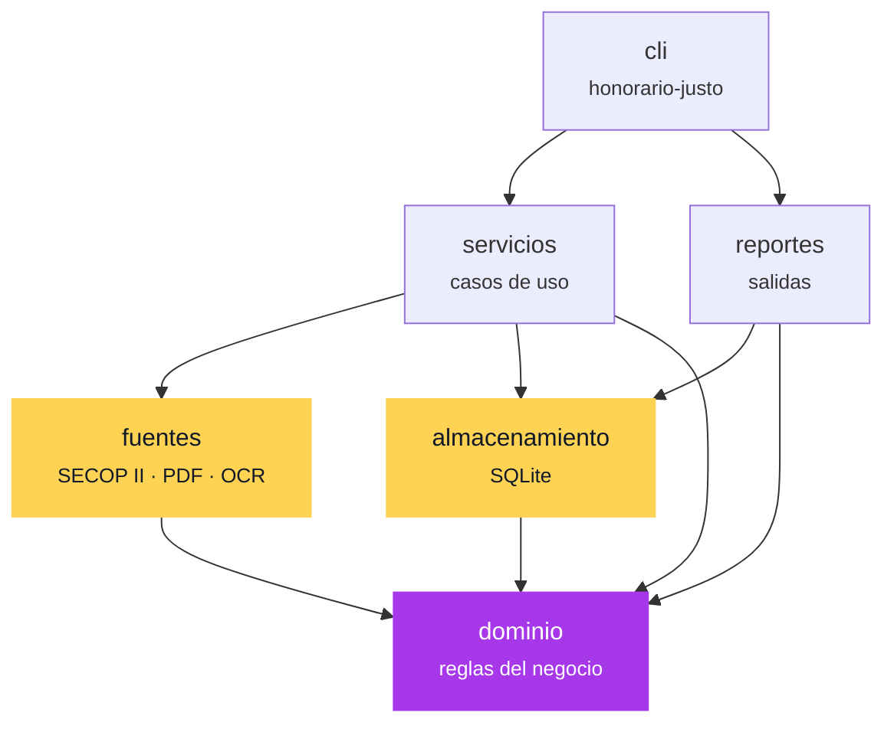
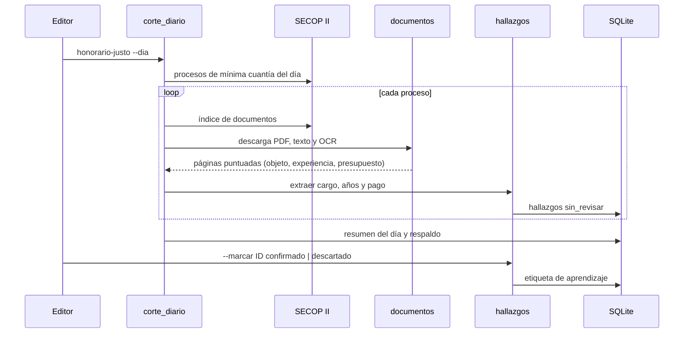

# Arquitectura

Honorario Justo está organizado en capas. Cada una depende solo de las de abajo, y el
dominio no depende de nada externo: se puede probar sin red, sin PDF y sin base de datos.

## Capas

| Capa | Módulos | Responsabilidad |
|---|---|---|
| `dominio` | `texto`, `extraccion`, `aprendizaje`, `formato` | Qué es un cargo, un pago mensual, la experiencia exigida y el SMLV de cada año. Señales de la página y reporte de aprendizaje. |
| `fuentes` | `secop`, `documentos`, `ocr.cjs` | API de Datos Abiertos (SECOP II), descarga de PDF, extracción de texto, OCR y puntuación de páginas. |
| `almacenamiento` | `base_datos` | Esquema SQLite, casos, hallazgos, resumen por día y copias de seguridad. |
| `servicios` | `analisis`, `busqueda`, `hallazgos`, `corte_diario`, `aprendizaje` | Casos de uso: analizar un proceso, corte diario, extraer y revisar hallazgos, aprender de las revisiones. |
| `reportes` | `indicadores`, `tablero`, `imagenes`, `investigacion` | Resumen por día, tablero HTML, imágenes para LinkedIn y TikTok, expediente de cada caso. |
| `cli` | `cli`, `__main__` | Comando `honorario-justo`. |

## Flujo del corte diario

## Decisiones

- **Trazabilidad antes que cobertura.** Cada hallazgo guarda archivo y página de origen. Una cifra sin fuente no se publica.
- **Revisión humana obligatoria.** La extracción automática propone; el editor confirma. Solo lo `confirmado` llega a los reportes publicables.
- **Aprender con evidencia.** Las reglas para saltar documentos que no aportan (por ejemplo, no hacer OCR a suministros) solo se proponen cuando `acumulado.md` junta al menos 30 revisiones. Nunca se aplican solas.
- **Local y reanudable.** SQLite, caché de texto por hash y OCR local. Un corte interrumpido retoma donde iba.
- **Sin efectos al importar.** El logging se configura en la CLI y la base se crea al primer uso, así cada módulo se puede importar y probar por separado.
